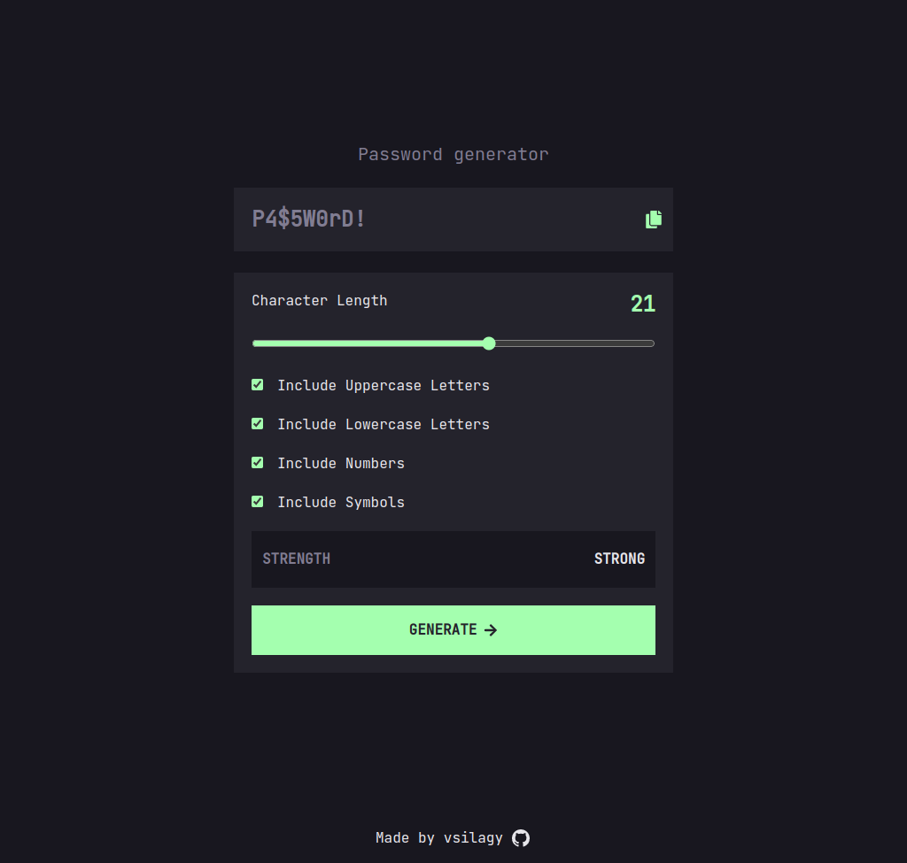

# Password generator

A password generator app built with React, TypeScript, Tailwind and Vite

[Live Preview](https://password-generator-vs.netlify.app/)

### Features

- generate passwords with letters, numbers and symbols
- password length between 8 and 30 random characters
- copy password to clipboard
- show password strength : too weak, weak, medium, strong
- updated to React TSX

## Built with:

- [React](https://reactjs.org/)
- [TypeScript](https://www.typescriptlang.org/)
- [Tailwind](https://tailwindcss.com/)
- [Vite](https://vitejs.dev/)
- [Netlify](https://www.netlify.com/)

### Frontend Mentor Challenge : [Password generator](https://www.frontendmentor.io/challenges/password-generator-app-Mr8CLycqjh)
